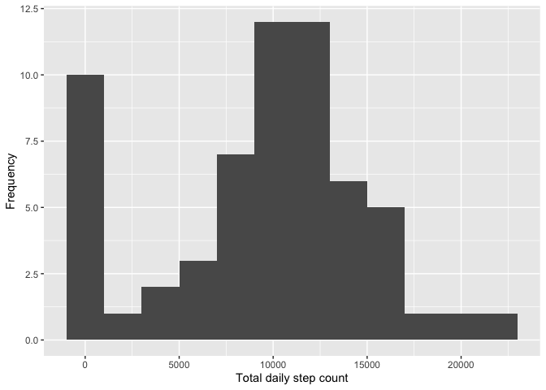
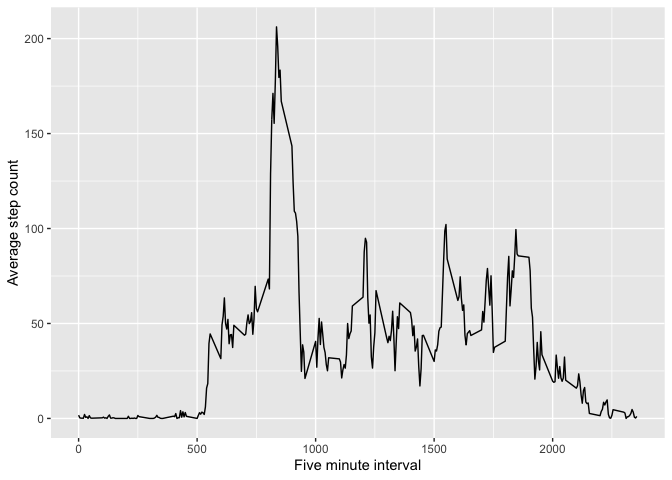
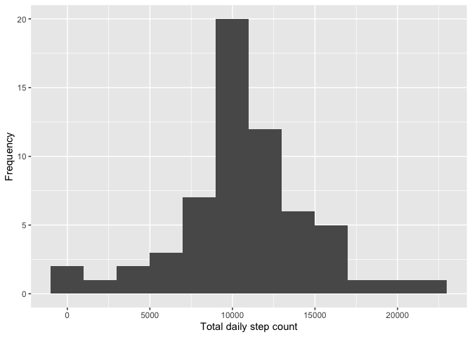
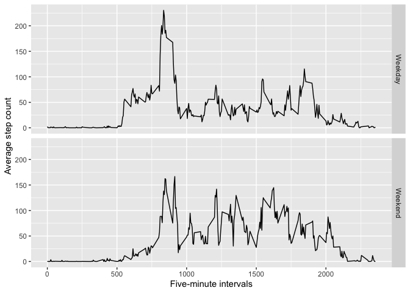

\#\#\#Loading data\#\#\#

    act <- read.csv("activity.csv")

\#\#\#What is the average total steps taken each day?

    total_steps <- act %>% 
     group_by(date) %>%
     summarise(steps.day = sum(steps, na.rm = TRUE))

\#\#Frequency of total daily step count\#\#

    ggplot(total_steps, aes(steps.day)) + geom_histogram(binwidth = 2000) + xlab("Total daily step count") + ylab("Frequency")

    mean <- mean(total_steps$steps.day, na.rm =T) 
    med <- median(total_steps$steps.day, na.rm = T) 

The average total daily step count 9354 and the average median number of
steps taken each day is 10395

## What is the average daily activity pattern?

    ###Average daily pattern###
    total_steps_int <- act %>%
     group_by(interval) %>%
     summarise(steps = mean(steps, na.rm = T))

    ggplot(total_steps_int, aes(x = interval, y = steps)) + geom_line() + xlab("Five minute interval") + ylab("Average step count")

    total_steps_int[which.max(total_steps_int$steps),]

    ## # A tibble: 1 x 2
    ##   interval steps
    ##      <int> <dbl>
    ## 1      835  206.

Interval 835 recorded the greatest step count per interval of 206 steps
\#\#Imputing Missing Values\#\#

    missing <- act[is.na(act[1]),]

    #impute missing values with interval averages across days
    impute_data <- act %>%
     mutate(
      steps= case_when(is.na(steps) ~ total_steps_int$steps[match(act$interval,total_steps_int$interval)], TRUE ~ as.numeric(steps))
     )

There are 2304 missing values in the original data set \#\#\#Plot
histogram with imputed data\#\#

    imputed <- impute_data %>% 
     group_by(date) %>% 
     summarise(im_stepsday = sum(steps))

    ggplot(imputed, aes(im_stepsday)) + geom_histogram(binwidth = 2000) + xlab("Total daily step count") + ylab("Frequency")

    im.mean <- mean(imputed$im_stepsday) 
    im.med <- median(imputed$im_stepsday) 
    diff.mean <- im.mean-mean
    diff.med <- im.med-med

Following imputation, the mean number of daily steps is 10,766 and the
median number of steps is 10,766. Imputation of missing values using the
mean number of steps per interval has increased the mean and median
steps by 1412 and 371 steps, respectively.

\#\#Are there differences in activity patterns between weekdays and
weekends?

    ##activity difference between weekday and weekend
    library(lubridate)

    ## 
    ## Attaching package: 'lubridate'

    ## The following objects are masked from 'package:base':
    ## 
    ##     date, intersect, setdiff, union

    Day.week <- impute_data %>% 
     mutate(
      date = ymd(date),
            day.end = case_when(wday(date) %in% 2:6 ~ "Weekday",
                                wday(date) %in% c(1,7) ~ "Weekend")
     ) %>% select(-date) %>%
     group_by(interval, day.end) %>%
     summarise(steps = mean(steps))

    ## `summarise()` has grouped output by 'interval'. You can override using the `.groups` argument.

    ###total step difference between weekdays and weekends
    tapply(Day.week$steps, Day.week$day.end, sum)

    ##  Weekday  Weekend 
    ## 10255.85 12201.52

    #Facet grid showing activity differences between weekends and weekdays
    ggplot(Day.week, aes(x = interval, y = steps)) + geom_line() + facet_grid(day.end ~ .) + ylab("Average step count") + xlab("Five-minute intervals")

During weekdays, more steps are taken between the 500 and 1000 intervals
but walking activity is greater during weekends between intervals
1000-1750 and the average step count per interval is 7 steps greater
during the weekend than during weekdays.
